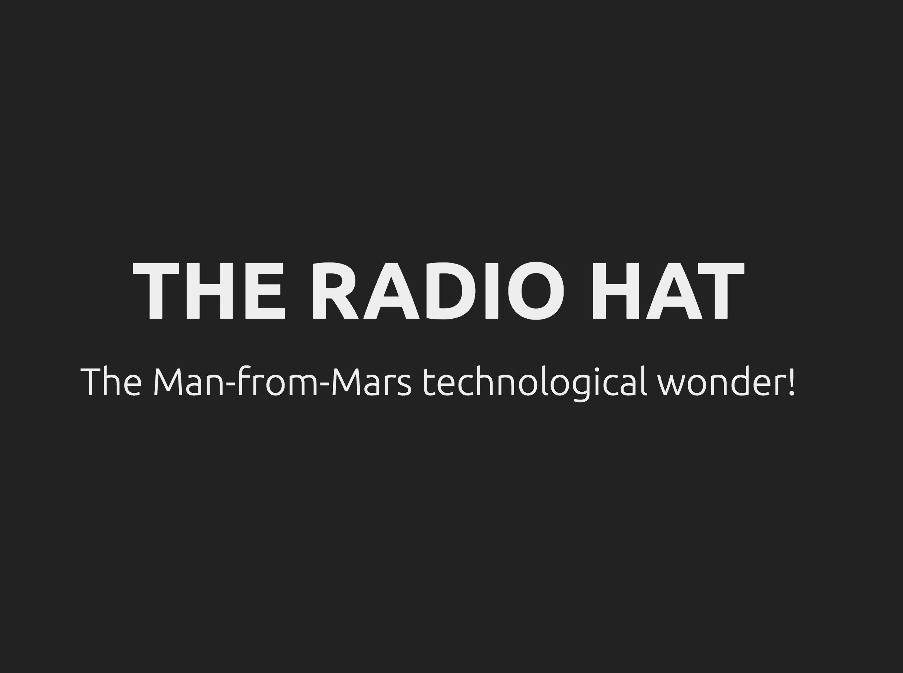
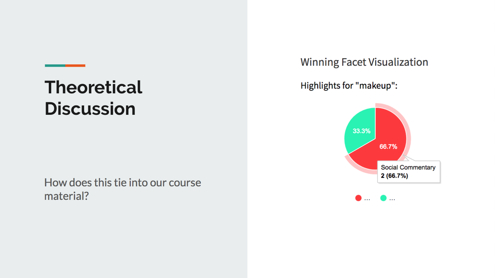

# IASC 2P02 | Serena Atallah

## About Me

I am a second year student in the Interactive Arts and Science course. My area of research is in text analysis. My research program involves breaking down long and dense scholarly articles using different deformance techniques. This allows me to analyze the work in question from different perspectives, so that I can perhaps find a new meaning or message. Using text analysis tools like Voyant, I am also able to generate word clouds and trend charts to aid me in understanding the article I am analyzing, before I go ahead and break it down to build my own interpretation of the work. This research focus is reflected in my projects in this portoflio, such as my collaborative project, PRISM, that shines a spotlight on the most basic of interpretation by collaboration of authors. My blog post looks at text analysis by using the Voyant tool, and how using word clouds and charts that show trends in language can help you understand a reading the way the author intended, and how that inference cn help you create new understanding. I'd like to continue with this work in the future by continuing to read scholarly articles about the digital humanities, and using deformance to respond to the works, and offer new ideas and theories that can work alongside the paper.

## Featured Project: [Pecha Kucha: The Radio Hat]

The featured project I have chosen here is a research project in the field of media archeology. Media archeology is the study of new and old media, and how you can take old, forgotten, idiosyncratic media and look at it anew. It also explores the idea of alternate histories, and what could happen if history had taken a different path. How that would affect our relationship with technology in our current time. The radio hat was a perfect choice for this assignment. I had never heard of the radio hat, it was completely forgotten, and I have no idea why. This hat, in my opinion, was a grandfather for wearable tech. It brought together the necessity of clothing, and the luxury of entertainment, and hosted it in one, funky looking hat. Upon researching I found that this hat was extremely short lived, due to a lot of technical issues like the directional antenna, and the unfortunately small reach of the radio signal, it just wasn’t convenient enough to act as a product worth using. My method behind finding more information behind this product, since it is so obscure, was to search like mad. Once I found a trustworthy article on the subject, I checked its resources, went ahead and followed those links. This allowed me to find more in depth information about certain aspects of the product I was interested in. Finding proper resources for an item such as this is extremely important. Because of its obscurity, it's imperative that the facts are reliable so we can fully understand the relationship between technology and the society in those times, and how that translates to modern times.

When researching this product, information was scarce I focussed more on the evolution of the wearable technology, but I did not focus on the relationship between the product, and items like it, and the people utilizing it. In two of the new slides I added, I discussed the importance of the radio back in the 1920’s and 30s, and how the relationship between the radio and consumers has been shifted to streaming and the radio is becoming obsolete. You can see those slide changes  [here](https://github.com/serenaatallah/IASC2P02/commit/e4ec8b971577e7d34cf5921b9d5f822f981cc166). I also decided to shine some light on how the failure of the radio hat translates to our technoculture of the modern society. Tech companies like Apple and Samsung are constantly renewing their products, and compete for the title of the most convenient, sleek, popular smartphone. You can see my expand on this [here](https://github.com/serenaatallah/IASC2P02/commit/31db9687dcc30f88236145c22b3900be1c4451c7). You can also see the additional slide I added on the topic as well in my first commit link. The last changes I made to this presentation were adding photos that coincided with the information displayed in the speaker notes section of the slides. I had a bit of a hard time with getting those to be displayed properly, though, through hard work and perseverance I was finally able to get those up and running. You can see them [here](https://github.com/serenaatallah/IASC2P02/commit/67e438bfaae3ae1acf24319218b741012563bd3d). In conclusion, through my original research results, and final revisions, it shows that I am able to revisit my project with fresh eyes and dig through my information to make new conclusions and interpretations.

Read about [The Radio Hat](https://serenaatallah.github.io/IASC2P02/reveal/)

## Collaborative Project: PRISM

For my collaborative project, my team and I decided to research a text analysis tool called “PRISM” by scholarslab. It is also a collaborative text analysis tool where users can gather together and use the highlighters given to them to express their own interpretations of the piece being analyzed. Along with the use of pie charts, and text visualization tools, we are able to visualize the data being collected by all the user input to gain a general understanding of the work in question. In the presentation we gave on this program, we used a song we were all familiar with to test the functionality of the program, as well as determine whether this could be used as a scholarly text analysis tool.

My portion of the collaborative project was the theoretical discussion. This entailed revising the research findings, using the tool, and reading scholarly articles to relate it back to course material. I had some pointers in my theoretical discussion folder that acted as notes to speak on during the presentation which are available [here](https://github.com/IascAtBrock/IASC-2P02-TeamPresentations/commit/c06d1cbe7028525db6d30146ef6c412e6e4e062c). I also contributed to the powerpoint presentation by making the slideshow, and integrating screencaps of the program we were presenting on. You can see the screencaps of my slides specifically [here](https://github.com/IascAtBrock/IASC-2P02-TeamPresentations/commit/fb38bfa132c951687282bfe2fa57366466a8c28b). There isn’t a lot of information on these slides, as we did not want to make them look boring or distracting to our audience, but we did try our best to make things simple but compelling to the viewers to maintain their attention. In our teams we were all organized, and communicated clearly as to what our portions of the project were, and asked each other questions if we were confused about anything. For me personally, I helped pick out the song for the research portion, and organized the testing done with the program. I also contributed to the research findings by participating in the research itself. I chose what topics the highlighters will be assigned (ex. Blue highlighter is for religious commentary in song), and then used the tools to interpret the song in my own way, (Chop Suey by System of a Down was our song of choice).

## Academic Blog: Stephen Ramsay

As per the course outline, we were only exposed to the preconditions and chapter one of this reading...[continue reading](publishblogpost.md)

## Research Presentation
[The Radio Hat](https://serenaatallah.github.io/IASC2P02/reveal/)
