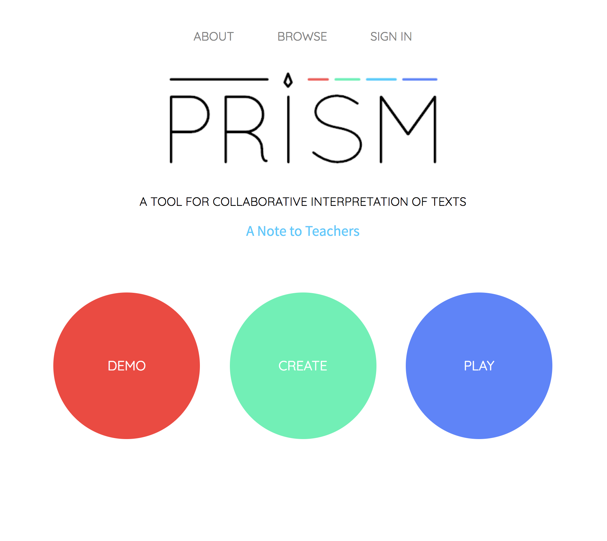

# IASC 2P02 | Serena Atallah

## About Me

I am a second year student in the Interactive Arts and Science course. My area of research is in text analysis. My research program involves breaking down long and dense scholarly articles using different deformance techniques. This allows me to analyze the work in question from different perspectives, so that I can perhaps find a new meaning or message. Using text analysis tools like Voyant, I am also able to generate word clouds and trend charts to aid me in understanding the article I am analyzing, before I go ahead and break it down to build my own interpretation of the work. This research focus is reflected in my projects in this portoflio, such as my collaborative project, PRISM, that shines a spotlight on the most basic of interpretation by collaboration of authors. My blog post looks at text analysis by using the Voyant tool, and how using word clouds and charts that show trends in language can help you understand a reading the way the author intended, and how that inference cn help you create new understanding. I'd like to continue with this work in the future by continuing to read scholarly articles about the digital humanities, and using deformance to respond to the works, and offer new ideas and theories that can work alongside the paper.

## Featured Project: [Pecha Kucha: The Radio Hat]

• A 250 word abstract introducing the work: its main argument (thesis), approach or methodology,
research findings, and significance within the field.
• A 250 word statement describing how this research evolved over time. This statement should describe
the revisions you made to the existing work based on instructor feedback. It should also explain how
your understanding of dh evolved based on the work undertaken.
• The 250 word statement describing how your research evolved over time (the bullet point just above)
must contain links to at least 3 commits that show the revisions described in the statement. Combined,
your 250 word statement and the commit links should show the nature and extent the revisions you 
made to the featured project. They should explicitly address any instructor feedback you are responding
to in your revisions.
• A link to the project, which is now updated in the manner you’ve described (this will be one of the same
links used for your three projects below).

The featured project I have chosen here is a research project in the field of media archeology. Media archeology is the study of new and old media, and how you can take old media and look at it anew. It also explores the idea of alternate histories, and what could happen if history had turned out differently. How that would affect our relationship with technology in our current time. The radio hat was a perfect choice for this assignment. I had never heard of the radio hat 

Here is my 250 word statement describing how this research evolved over time. I made these changes, which you can see [here](https://github.com/IascAtBrock/IASC-2P02/commit/3848629cb7488d618fcac6582fd03ebc3cf6e0a1#diff-e95c7dc8eefee7d0e25121cd7f0007ae). I also made these changes, which you can see [here](https://github.com/IascAtBrock/IASC-2P02/commit/df05b5022c6131df49b377153cfd202a98d5d6bf#diff-e95c7dc8eefee7d0e25121cd7f0007ae). I also made these changes, which you can see [here](https://github.com/IascAtBrock/IASC-2P02/commit/e5224ea6fdccca454f4f3d58811a9024ab118f49#diff-e95c7dc8eefee7d0e25121cd7f0007ae). Overall these changes show x and y changes in my thinking.

Read about [The Radio Hat](https://serenaatallah.github.io/IASC2P02/reveal/)

## Collaborative Project: PRISM

Here is my 100-word project description.

Here is my 250-word collaboration statement. I approach collaboration in x ways, which is reflected in y work (available [here](https://github.com/IascAtBrock/IASC-2P02-TeamPresentations/commit/73ddd6787012bed37cd6ffec2d604758e70257c5)). I also approach collaboration in a ways, which is reflected in b work (available [here](https://github.com/IascAtBrock/IASC-2P02-TeamPresentations/commit/fe9a128beb56d6a13ea8b3739e7889ed3d033dfa)). I also contributed x assets to my team, seen below.

## Academic Blog: Stephen Ramsay

As per the course outline, we were only exposed to the preconditions and chapter one of this reading...[continue reading](publishblogpost.md)

## Research Presentation
[The Radio Hat](https://serenaatallah.github.io/IASC2P02/reveal/)
